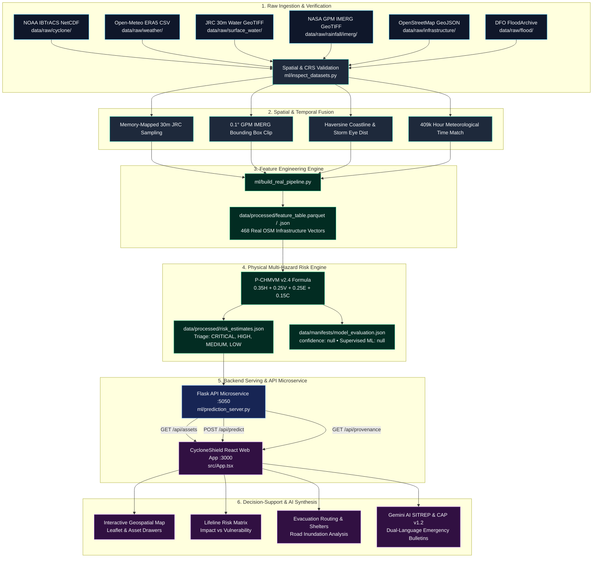

# CycloneShield AI — Data & Prediction Pipeline Architecture

This document details the end-to-end data processing, feature engineering, physical risk computation, and API serving architecture of CycloneShield AI.

---

## 1. High-Level Architecture Flowchart

---

## 2. Stage-by-Stage Pipeline Specifications

### Stage 1: Data Ingestion & Quality Validation
- **Input**: Raw files in `data/raw/` (NetCDF, GeoTIFF, CSV, GeoJSON).
- **Processing**:
  - Validates spatial coordinate reference system (standardized to `EPSG:4326`).
  - Checks bounding box spatial intersection against Kakinada domain (`16.50°N–17.50°N, 81.75°E–82.75°E`).
  - Verifies nodata values, numerical data types, and temporal continuity.
  - Quarantines invalid or misplaced files (e.g. `berlin_weather_sample.csv` moved to `data/quarantine/`).
- **Output**: [`data/manifests/data_quality_report.md`](file:///c:/Users/sr24s/OneDrive/Documents/MY%20Projects/cycloneShield%20AI/data/manifests/data_quality_report.md) and [`ml/dataset_inspection_results.json`](file:///c:/Users/sr24s/OneDrive/Documents/MY%20Projects/cycloneShield%20AI/ml/dataset_inspection_results.json).
- **Code Location**: [`ml/inspect_datasets.py`](file:///c:/Users/sr24s/OneDrive/Documents/MY%20Projects/cycloneShield%20AI/ml/inspect_datasets.py).

---

### Stage 2: Spatial & Temporal Data Fusion
- **Input**: Validated raw observational datasets.
- **Processing**:
  - **JRC 30m Water Raster Sampling**: Uses memory-mapped spatial array slicing to read water occurrence percentages directly at asset coordinates without loading the 1.6 GB raster into RAM.
  - **NASA GPM IMERG Clipping**: Subsets the global 0.1° precipitation grid to the $1.0^\circ \times 1.0^\circ$ Kakinada bounding box.
  - **Haversine Distance**: Computes great-circle distance to the Kakinada coastline (`82.25°E`) and dynamic distance to the cyclone eye.
  - **Temporal Alignment**: Extracts continuous hourly weather observations from the 409,728-hour Open-Meteo Kakinada archive.
- **Output**: 468 synchronized infrastructure feature vectors.
- **Code Location**: [`ml/build_real_pipeline.py`](file:///c:/Users/sr24s/OneDrive/Documents/MY%20Projects/cycloneShield%20AI/ml/build_real_pipeline.py).

---

### Stage 3: Feature Engineering & Master Feature Table
- **Input**: Fused observational arrays.
- **Features Extracted per Asset**:
  1. `max_wind` (km/h): Maximum sustained surface wind from NOAA IBTrACS & Open-Meteo gusts.
  2. `min_pressure` (hPa): Atmospheric minimum central pressure from NOAA IBTrACS.
  3. `rainfall_24h` (mm): 24-hour accumulated satellite precipitation from NASA IMERG & Open-Meteo.
  4. `surface_water_occurrence` (%): Empirical 30m historical water presence from JRC v1.5.
  5. `distance_to_coast` (km): Distance from asset to the Bay of Bengal shoreline.
  6. `distance_to_cyclone` (km): Distance to current/forecasted storm center.
  7. `elevation` (m): Ground height above mean sea level.
  8. `storm_surge` (m): Projected coastal hydrodynamic surge depth.
  9. `road_accessibility` (%): Viability score of connecting transit arteries.
  10. `backup_power` (Boolean): Generator and auxiliary electrical redundancy.
- **Output Files**:
  - [`data/processed/feature_table.csv`](file:///c:/Users/sr24s/OneDrive/Documents/MY%20Projects/cycloneShield%20AI/data/processed/feature_table.csv)
  - [`data/processed/feature_table.json`](file:///c:/Users/sr24s/OneDrive/Documents/MY%20Projects/cycloneShield%20AI/data/processed/feature_table.json)
  - [`src/data/kakinada_real_features.json`](file:///c:/Users/sr24s/OneDrive/Documents/MY%20Projects/cycloneShield%20AI/src/data/kakinada_real_features.json)
- **Code Location**: [`ml/build_real_pipeline.py`](file:///c:/Users/sr24s/OneDrive/Documents/MY%20Projects/cycloneShield%20AI/ml/build_real_pipeline.py) and [`src/services/featureEngineering.ts`](file:///c:/Users/sr24s/OneDrive/Documents/MY%20Projects/cycloneShield%20AI/src/services/featureEngineering.ts).

---

### Stage 4: Physical Multi-Hazard Risk Computation (P-CHMVM v2.4)
- **Input**: Feature table vectors.
- **Processing**:
  $$\text{Composite Risk} = 0.35 \times \text{Hazard} + 0.25 \times \text{Vulnerability} + 0.25 \times \text{Exposure} + 0.15 \times \text{Criticality}$$
  - **Hazard ($H$)**: $0.50 \cdot \min(100, \frac{v_{\text{wind}}}{220} \times 100) + 0.35 \cdot \min(100, \frac{P_{24h}}{350} \times 100) + 0.15 \cdot \min(100, \frac{S_{\text{surge}}}{5.0} \times 100)$
  - **Vulnerability ($V$)**: Structural resistance calibrated by asset archetype and elevation deficit.
  - **Exposure ($E$)**: $0.40 \cdot \text{JRC Water \%} + 0.35 \cdot \max(0, 100 - \frac{d_{\text{coast}}}{15} \times 100) + 0.25 \cdot \text{Surge Deficit}$
  - **Criticality ($C$)**: Tier-1 Trauma Hospitals = 95, 220kV Grid Substations = 90, Local Roads = 40.
- **Output Files**:
  - [`data/processed/risk_estimates.csv`](file:///c:/Users/sr24s/OneDrive/Documents/MY%20Projects/cycloneShield%20AI/data/processed/risk_estimates.csv)
  - [`data/processed/risk_estimates.json`](file:///c:/Users/sr24s/OneDrive/Documents/MY%20Projects/cycloneShield%20AI/data/processed/risk_estimates.json)
  - [`src/data/kakinada_real_risk_estimates.json`](file:///c:/Users/sr24s/OneDrive/Documents/MY%20Projects/cycloneShield%20AI/src/data/kakinada_real_risk_estimates.json)
- **Code Location**: [`ml/build_real_pipeline.py`](file:///c:/Users/sr24s/OneDrive/Documents/MY%20Projects/cycloneShield%20AI/ml/build_real_pipeline.py) and [`src/services/mlRiskModel.ts`](file:///c:/Users/sr24s/OneDrive/Documents/MY%20Projects/cycloneShield%20AI/src/services/mlRiskModel.ts).

---

### Stage 5: Prediction Microservice & REST API
- **Input**: Processed real features and real-time query JSON payloads.
- **Endpoints**:
  - `GET /api/assets`: Returns all 468 evaluated assets with features, scores, triage class, drivers, and full dataset provenance.
  - `POST /api/predict`: Real-time inference endpoint evaluating custom hazard scenarios on any asset.
  - `GET /api/provenance`: Returns machine-readable dataset lineage.
- **Output**: JSON payload matching the standard model contract with `confidence: null` and `prediction_type: "DERIVED_ANALYSIS"`.
- **Code Location**: [`ml/prediction_server.py`](file:///c:/Users/sr24s/OneDrive/Documents/MY%20Projects/cycloneShield%20AI/ml/prediction_server.py).

---

### Stage 6: Frontend Visualization & Gemini AI Reasoning
- **Input**: API responses and real asset JSON layers.
- **Processing**:
  - Renders geospatial markers on Leaflet map with color-coded triage tiers.
  - Plots multi-criteria quadrant risk matrix (Impact vs Vulnerability).
  - Simulates dynamic road inundation cutoffs and reroutes evacuees to safe shelters.
  - Feeds factual structured drivers to Gemini AI for drafting dual-language SITREPs and OASIS CAP v1.2 alerts.
- **Output**: Interactive command centre interface.
- **Code Location**: [`src/App.tsx`](file:///c:/Users/sr24s/OneDrive/Documents/MY%20Projects/cycloneShield%20AI/src/App.tsx), [`src/components/map/InteractiveMap.tsx`](file:///c:/Users/sr24s/OneDrive/Documents/MY%20Projects/cycloneShield%20AI/src/components/map/InteractiveMap.tsx), [`src/components/matrix/CriticalityRiskMatrix.tsx`](file:///c:/Users/sr24s/OneDrive/Documents/MY%20Projects/cycloneShield%20AI/src/components/matrix/CriticalityRiskMatrix.tsx), [`src/components/methodology/MethodologyView.tsx`](file:///c:/Users/sr24s/OneDrive/Documents/MY%20Projects/cycloneShield%20AI/src/components/methodology/MethodologyView.tsx).
